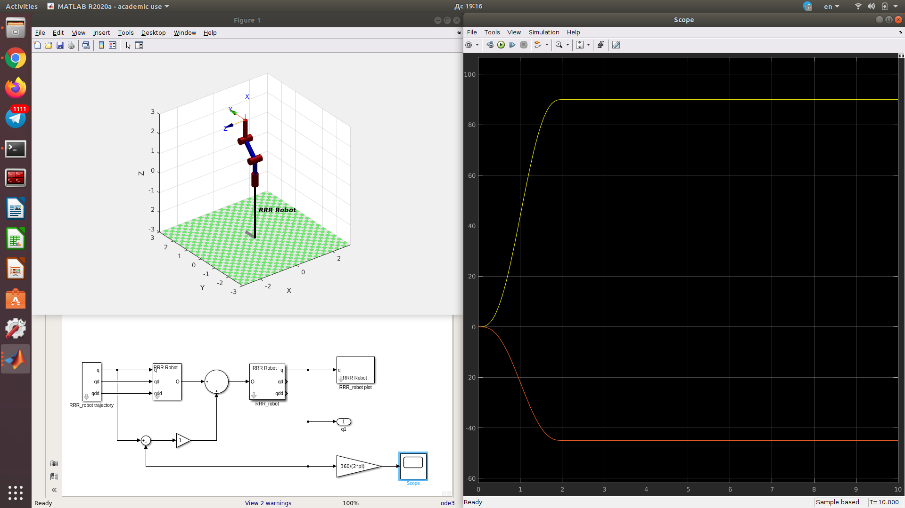

# Laboratory 5. Part 2

Robot manipulator motion modelling.

### 1st approach 
Joint positions PID using gains only.

### 2nd approach
Joint positions PID + gravity compensation. Without inertia and mass, without velocity compensation

Joint positions PID + gravity compensation + joint velocity PID. Without inertia and mass, with velocity compensation.

### 3rd approach
Joint positions PID + inverse dynamic model. With inertia and mass, without velocity compensation.

Joint positions PID + inverse dynamic model + joint velocity PID. With inertia and mass, with velocity compensation.

