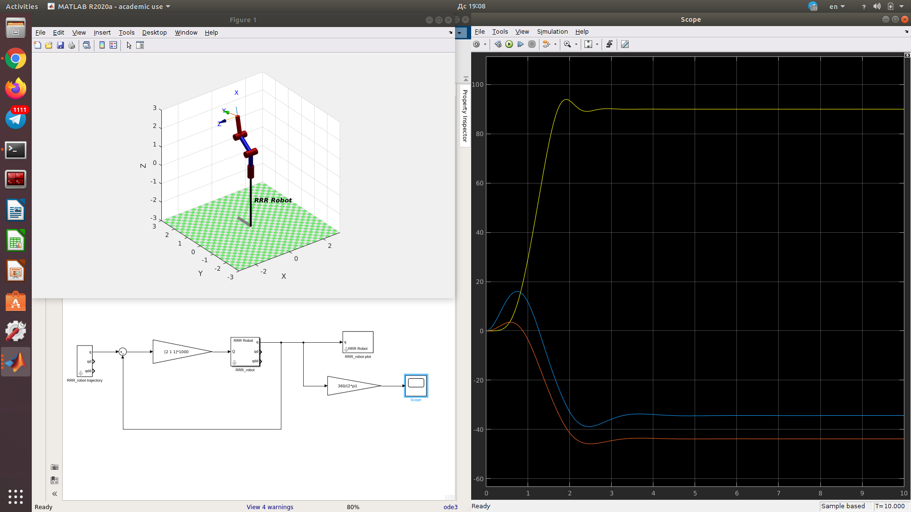
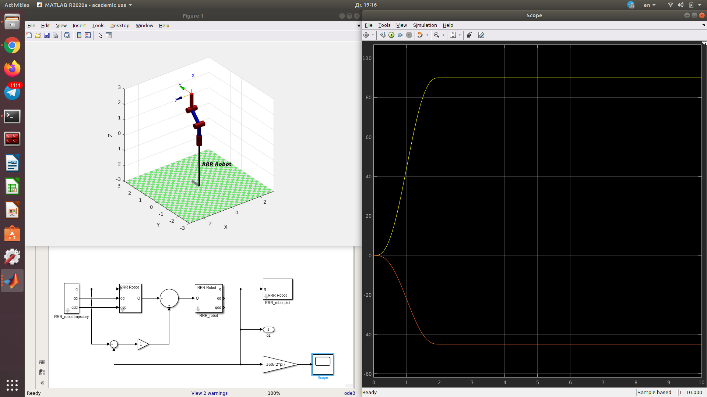
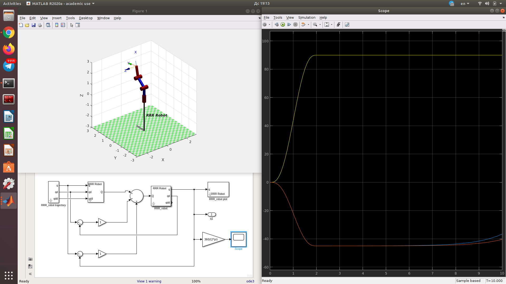

# Laboratory 5. Part 2

Robot manipulator motion modelling. As it can be seen from the following images, multiple variations of manipulator control modelling were implemented. As it can be clearly seen, all methods achieved desired positions in 2s time interval. Things that are worth noting are:
1. For the PID case, high gains were used in order to compensate for gravity.
2. Gravity compensation performed well with a very low error in a case were no inertia and mass were present. 
3. Although the case were dynamic model that had inertia and masses did work, the error fluctuated higher than in the case without them.
4. Velocity compensation did not bring any benefits for any case.

### 1st approach 
Joint positions PID using gains only.

### 2nd approach
Joint positions PID + gravity compensation. Without inertia and mass, without velocity compensation

Joint positions PID + gravity compensation + joint velocity PID. Without inertia and mass, with velocity compensation.

### 3rd approach
Joint positions PID + inverse dynamic model. With inertia and mass, without velocity compensation.

Joint positions PID + inverse dynamic model + joint velocity PID. With inertia and mass, with velocity compensation.
