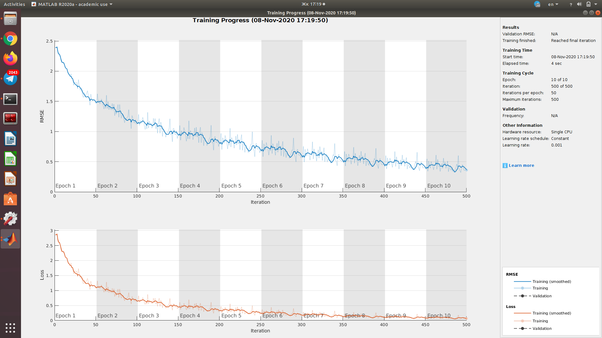
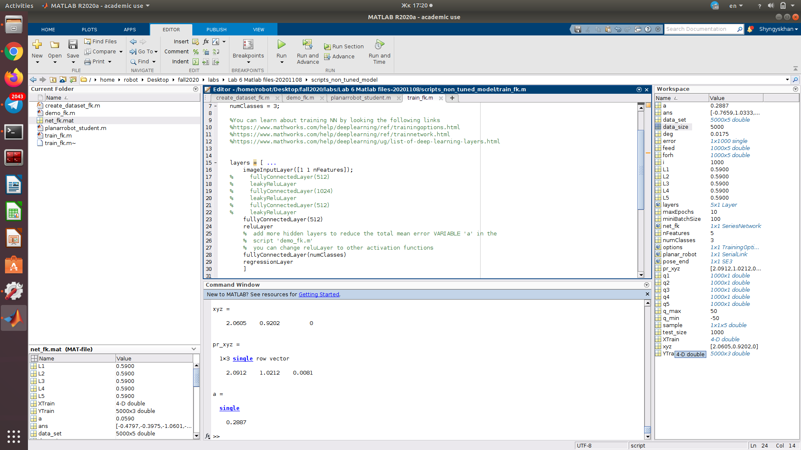
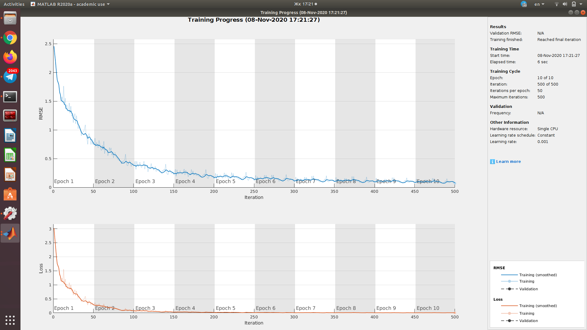
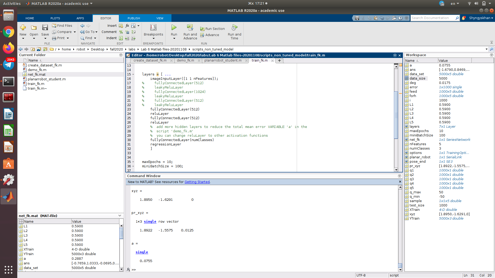
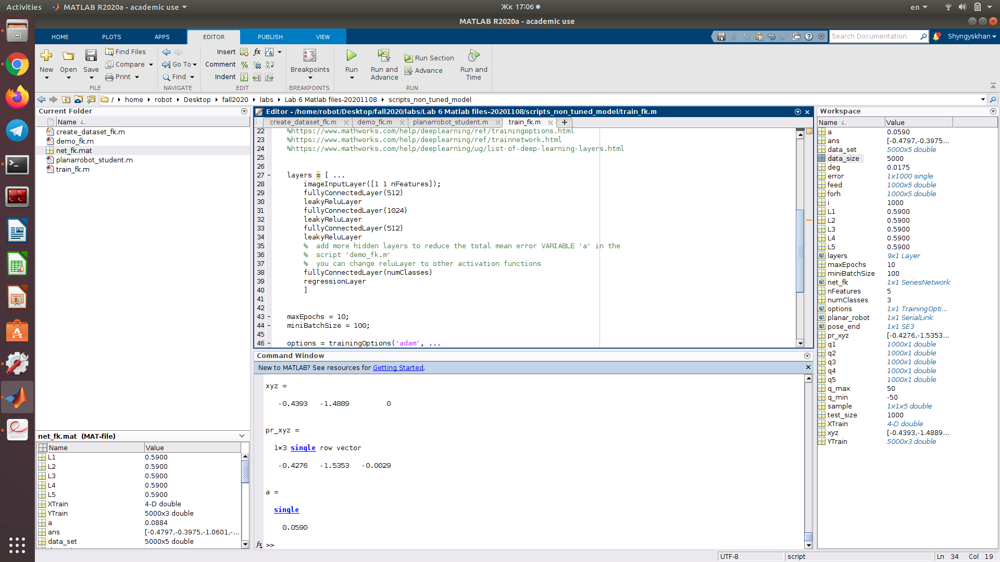
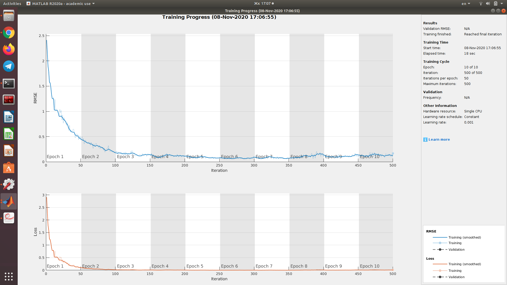
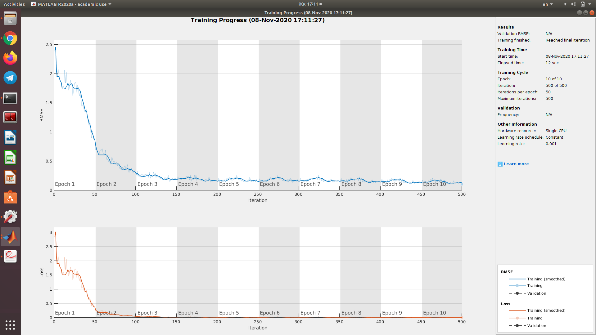
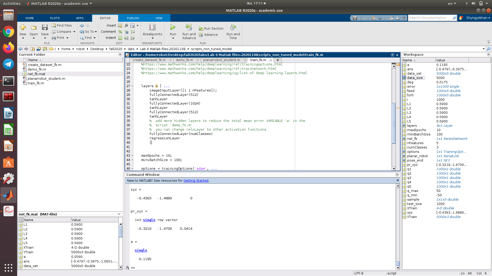
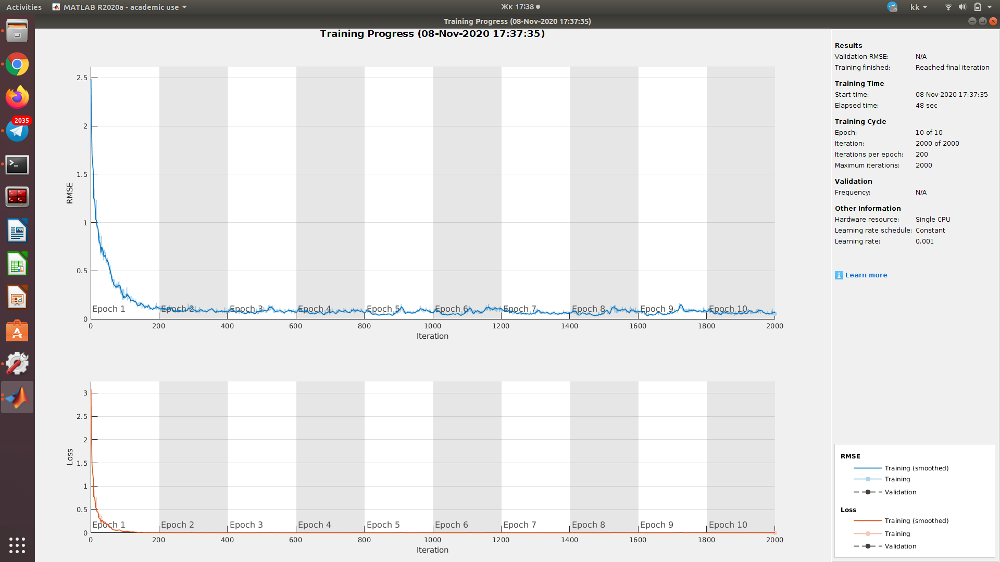
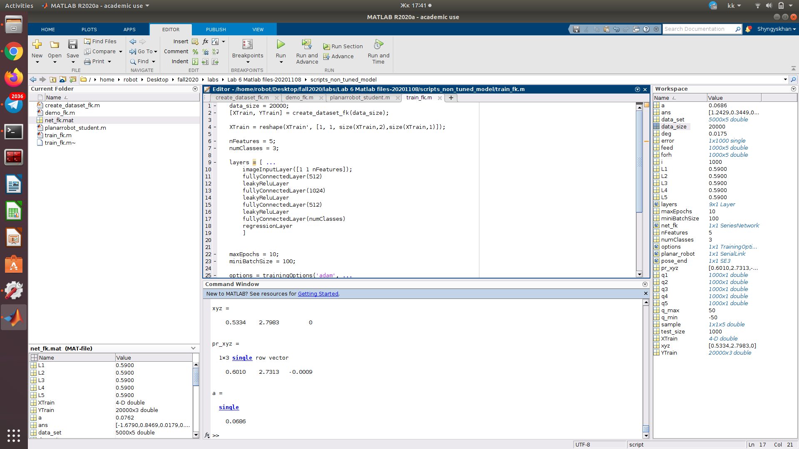

# Laboratory 6.

### Initial architecture 

### Additional FC Layer

### Switch ReLu to LeakyReLu

### 512-1024-512 architecture
This architecture has proven to show the best performance on test data.

### 512-1024-1024-512 architecture
Additional layer was added to test if architecture will perform better. Showed worse results.

### 1024-2048-1024 architecture
Additional neurons were added to test if the architecture will perform better. Showed worse results.

### Tanh activation function
Changed to see if tanh activation function will perform better. Showed worse results.

### Final architecture + change of training parameters
This is the final architecture. Best results. Mean error 6.8%.

Finally change number of training samples, number of epochs, and minibatch sizes. Showed even better results and mean error of 3%.

