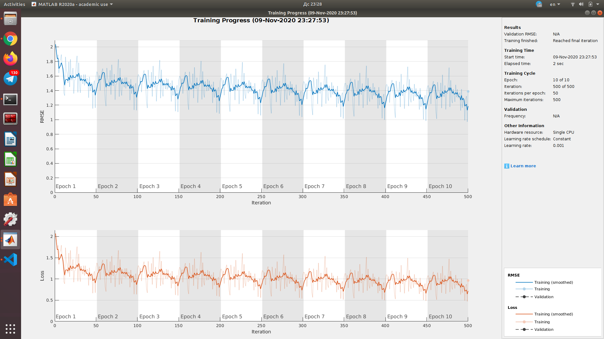
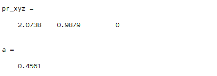
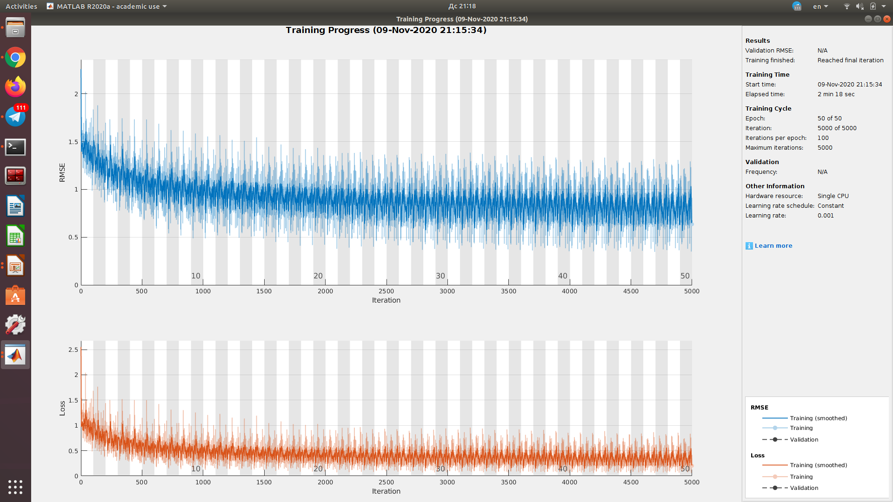
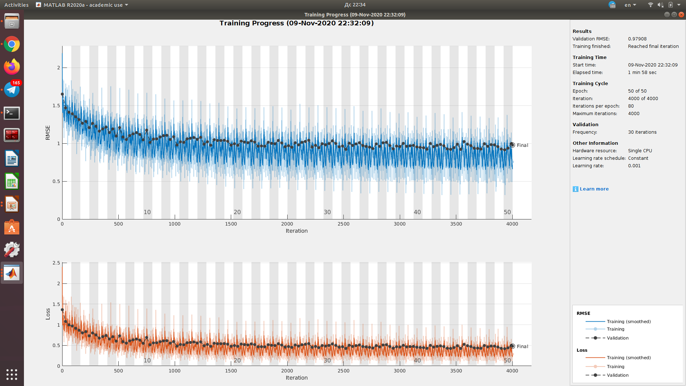
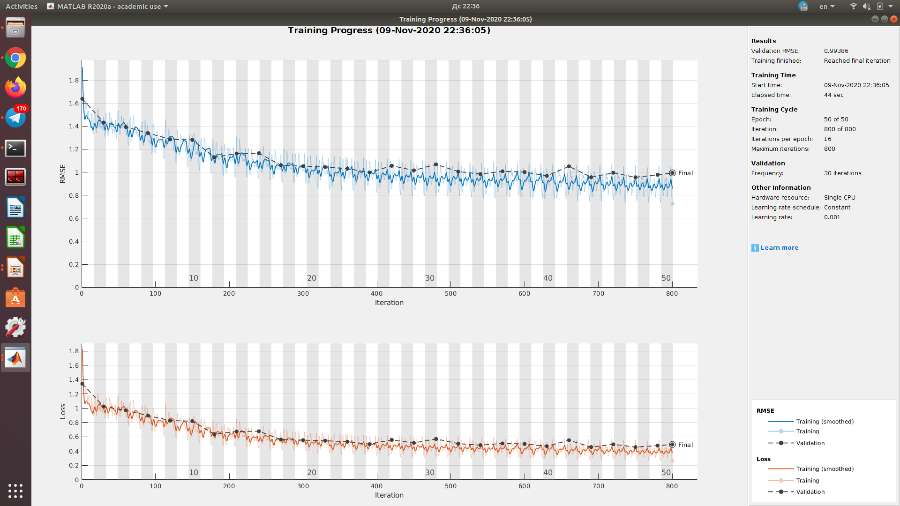
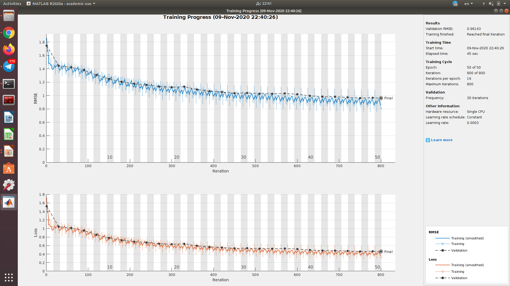
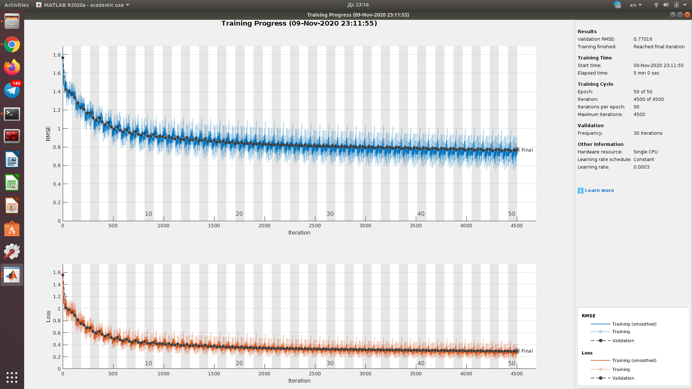
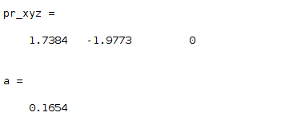

# Laboratory 7.

### Initial structure.
Initial given structure with architecture and parameters have an accuracy of 45% for solving IK problem. Dataset with 5k number of data was used.

### Updated architecture
Insertion of additional fully-connected layers and increase in number of neurons gave a 21% accuracy.

### Data Validation
To further improve training process and reduce overtrain, main data was split into train and validation parts. Accuracy decreased and was 24.37%.

### Batch size update
Increased batch size to 500 gave similar accuracy of 24.11%, but heavily reduced rapid fluctuations during training process.

### Updated LR
Learning rate and squared gradient decay factor were updated. Still accuracy at 25%.

### 50k Dataset
Finally, all updates were integrated into the same script for the training process. Moreover, much bigger data set was used (50k data points). With 2k number of validation data and 48k training data, model gave accuracy 18.8%

### Final results
To further increase accuracy and reduce the rate of overtraining, bigger number of validation data (5k) was used at the cost of training data (45k). Final achieved accuracy was found to be 16.5%.

