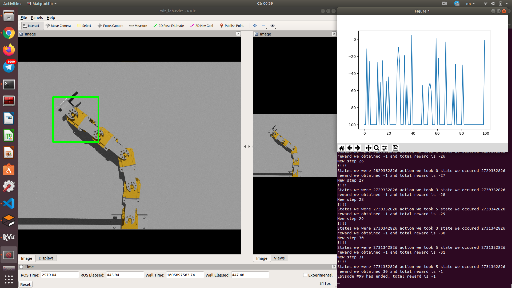
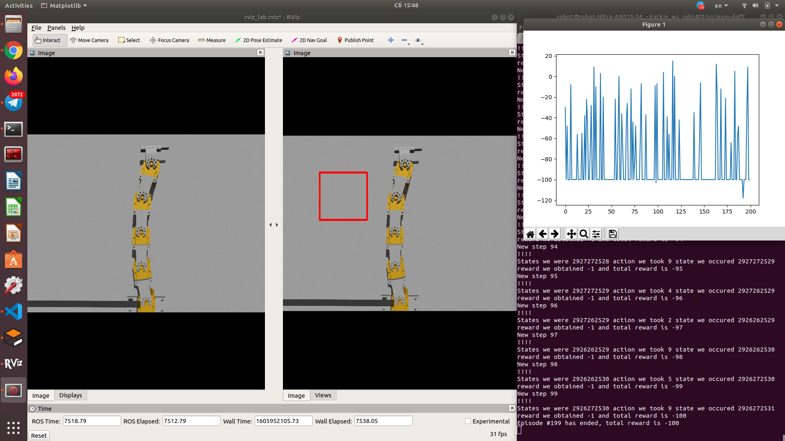
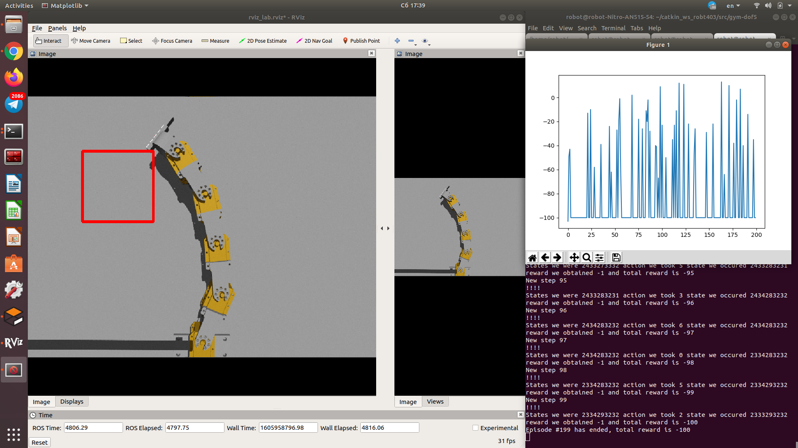
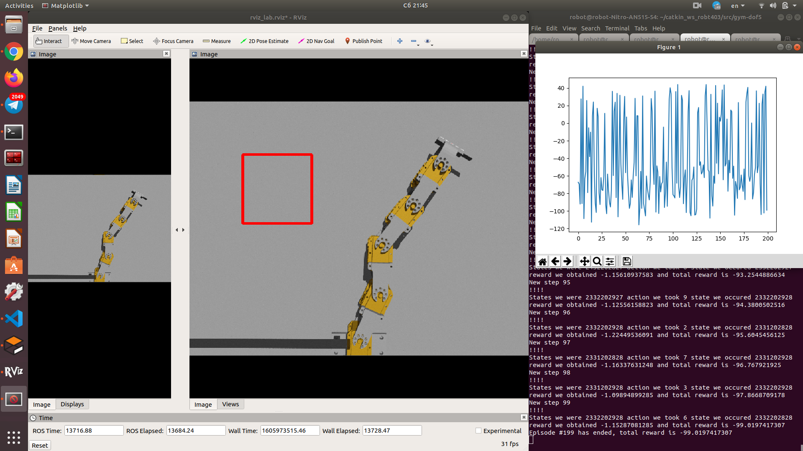
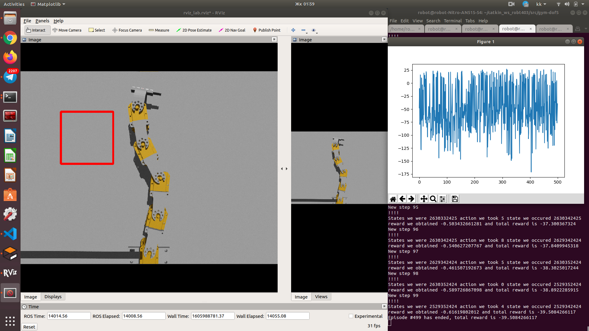
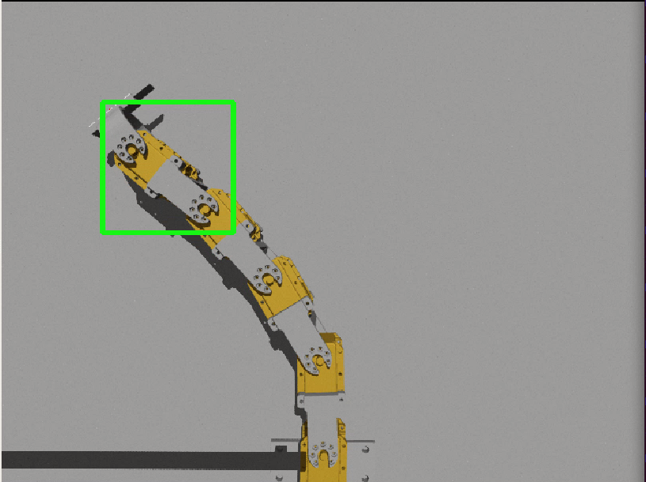
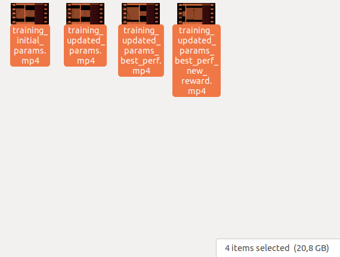

# Laboratory 8.

### Training Environment

Initial environment consisted of 5DOF planar robot whose task was to reach a desired position in its workspace. The observations are made based on the images obtained from the camera installed on top which can view whole robot. The action space consist of 5 indiviudal commands given to the robot acutators. 

### Rewards
The robots goal is to reach a desired position in its workspace. If it reached it, it will receive high reward. If any of the robots joints have moved more than a particular angle or the robots end-effector goes out of range, it receives penalty. Moreover, it receive minor (-1) prenalty for each timestep. Thus, the robots task is to reach the desired position in a least time stamps.

### Initial parameters
Initial parameters for the training were `alpha=0.9, gamma=0.1, epsilon=0.1` which where used for initial training and testing. The problem with these parameters was that the epsilon, the exploration parameter, was initilally too low. Moreover, the initial gamma parameter set was too low. Gamma is the value of future rewards. It means that low value of gamma means that robot will value mostly immediate reward and not focus on the final one. As the robot initially receives simply -1 reward for each time stamp, it was insufficient for initial training. 



### Problem with the "is_done" topic
During the training process, it was observed that althogh the robot reached the desired position inside a rectangle, it was not counted as reaching a goal. I have dived deeper into code and found that although the size of the rectangle was increased to 130x130 pixels in RViZ, the actual script that control the reach condition was not updated. Therefore, code on 40 line in the `node_camera.py` was updated to the following:

```python
    if (coord_x < 230 and coord_x > 100 and coord_y < 230 and coord_y > 100):
        done = True
```



### Brand new reward function
After some more tests with the updated parameters and the fixed camera output, there seemed to be no much progress in the learning rate. 



Therefore, I have decided to make updates to the reward function. As it was stated earlier, one of the main issues with the initial reward function is that robot receives the same immediate reward. Therefore, the tunning of gamma parameter towards long term goals was desirable, but it did not help. Thus, the reward given at each time stamp now was replaced with the scaled factor of the euclidean distance to the goal. To do so it was firstly required to create a new topic published in the `node_camera.py` script.

```python
    lower, upper = 0, 300
    if (coord_x==0 or coord_y==0):
        distance_scaled = 2
    else:
        distance  = (np.sqrt((coord_x - 165)**2 + (coord_y - 165)**2))
        distance_scaled = distance/upper
    ...

    dist_pub.publish(Float64(distance_scaled))

    ...

    dist_pub = rospy.Publisher("euclidean_distance", Float64, queue_size=100)

```

Given that function now robot receives a smaller negative reward if it gets closer to the goal (less than -1) and higher reward if it moves away from the goal position (higher than -1, but less than -2). Now to feed that information to the main reward function, following updated to the `gazebo_5dof.py` were made:


```python
		reward = -rospy.wait_for_message('euclidean_distance', Float64).data

		if (trans[0] < 0 or abs(angles.position[0]) > 1.57 or abs(angles.position[1]) > 1.57 or abs(angles.position[2]) > 1.57 or abs(angles.position[3]) > 1.57 or abs(angles.position[4]) > 1.57):
			done = True
			reward = -20 # If it fails, then reward is -20
		elif (rospy.wait_for_message('isDone', Bool).data):
			done = True
			reward = 30 # If succeeds then 30
		print("!!!!")
```




### Updated parameters for new reward function
Finally, new parameters for training of therobot using the updated reward function were used and are as follows:
`alpha=0.2, gamma=0.4, epsilon=0.9`. As it can be clearly seen, the exploration (epsilon) parameter was set to a high value. This was done in order to ensure that the learning algorighm see the pattern of ways of both decreasing and increasing the total reward in the end of episode. Moreover, updates to the change in the epsilon value were incorporated as follows:

```python
    if qlearn.epsilon > 0.02:
        qlearn.epsilon *= 0.99 # REDUCE THE EPSILON MUCH FASTER
```

This was done so that robot closer to a finish of training uses the best policy and exploit the learning experience that was obrained during the training process. This should have reduced the number of random fluctiations. The gamma parameter was chosen in such a way so that it gives more attention to the immediate reward, the euclidean distance, to minimize, but also still try to minimize the total reward of the episode. Finally, to use the full benefit of training, the number of episodes was to a number of 500 episodes (took 2 hours of training). The final learning process curve can be seen below:



As it was observed during the process, the robot was reaching the goal position much more often during the training process and its total episode rewards at final stages of the learning were also much higher.




NB: the videos of the training process were also recorded, but they weighted too much (20Gb+) and YouTube was not able to process any.
